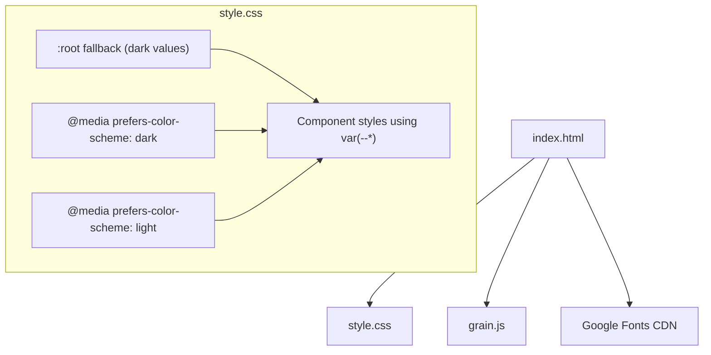

# Design Document: Theme and Font Update

## Overview

This design updates a static HTML/CSS/JS portfolio site to support automatic light/dark theming via `prefers-color-scheme` media queries and replaces the heading font (DM Serif Display) with a modern sans-serif alternative. The approach is CSS-only for theming — no JavaScript theme switching logic is needed. The grain overlay opacity will be adjusted per-theme to remain subtle in both modes.

### Design Decisions

1. **Parallel media query structure**: Both dark and light themes are defined as equal, parallel `@media (prefers-color-scheme: ...)` blocks. A bare `:root` block provides fallback values (dark theme) for browsers that don't support the media query. This avoids a "default + override" pattern and treats both themes as first-class citizens.

2. **Font choice — Roboto**: Replace DM Serif Display with Roboto (weight 700) for the h1 heading. Roboto is a widely available, tasteful sans-serif on Google Fonts that pairs well with Inter. It provides visual prominence at heavier weights without clashing with the existing typography.

3. **Grain overlay adaptation**: The grain canvas opacity is controlled via CSS on the `#grain` element. In light mode, the opacity is reduced further (e.g., 0.02) so the noise doesn't muddy the white background.

4. **No HTML structural changes**: All theming is achieved through CSS custom property redefinition inside media queries. No new HTML elements or JavaScript changes are required.

## Architecture

The architecture remains a static site with three files. The only structural change is in how CSS custom properties are organized.



### CSS Custom Property Flow

```
Browser preference detected?
├── Yes: dark  → @media (prefers-color-scheme: dark) { :root { ... } }
├── Yes: light → @media (prefers-color-scheme: light) { :root { ... } }
└── No         → bare :root { ... } (fallback, dark values)
```

Both media query blocks override the bare `:root` when the browser supports `prefers-color-scheme`. The component styles (`body`, `.doc-card`, `a:hover`, etc.) reference `var(--bg)`, `var(--text)`, etc. and automatically pick up whichever theme is active.

## Components and Interfaces

### 1. CSS Custom Properties (style.css)

The existing `:root` block is restructured into three blocks:

| Block | Scope | Purpose |
|-------|-------|---------|
| `:root` (bare) | Fallback | Dark theme values for browsers without media query support |
| `@media (prefers-color-scheme: dark) { :root { ... } }` | Dark mode | Dark theme values (identical to fallback) |
| `@media (prefers-color-scheme: light) { :root { ... } }` | Light mode | Light theme values |

All three blocks define the same set of custom properties:
- `--bg`, `--surface`, `--border`, `--accent`, `--text`, `--text-dim`, `--text-meta`

Font variables (`--font-serif`, `--font-sans`, `--font-mono`) remain in the bare `:root` since they don't change between themes. The `--font-serif` variable is renamed/updated to reference Roboto instead of DM Serif Display.

### 2. Light Theme Color Palette

| Property | Dark Value | Light Value | Rationale |
|----------|-----------|-------------|-----------|
| `--bg` | `#0E1116` | `#FAFAFA` | Near-white, avoids harsh pure white |
| `--surface` | `#141920` | `#FFFFFF` | White card surfaces on off-white bg |
| `--border` | `#1E2530` | `#E2E5E9` | Subtle gray border visible on white |
| `--accent` | `#3E8E7E` | `#2E7D6E` | Slightly darker teal for contrast on light bg |
| `--text` | `#E6E6E6` | `#1A1A1A` | Near-black text on light bg |
| `--text-dim` | `#8A8F98` | `#5A5F68` | Darker dim text for light bg readability |
| `--text-meta` | `#6B7280` | `#7C8290` | Slightly lighter meta for light bg |

### 3. Theme-Aware Component Adjustments

Components that need per-theme tweaks beyond custom property swaps:

- **`.doc-card:hover` shadow**: Dark uses `rgba(0,0,0,0.3)`, light uses `rgba(0,0,0,0.08)` — softer shadow on light backgrounds.
- **`.doc-card:hover` border-color**: Dark uses `#2A3340`, light uses `#CBD0D8` — visible against light surface.
- **`#grain` opacity**: Dark uses `0.03`, light uses `0.02` — reduced grain on light backgrounds.

These adjustments are placed inside the respective `prefers-color-scheme` media queries or handled via additional custom properties.

### 4. Google Fonts Link (index.html)

The `<link>` tag is updated:
- Remove: `DM+Serif+Display`
- Add: `Roboto:wght@700`
- Keep: `Inter:wght@300;400;500` and `JetBrains+Mono:wght@300;400`

### 5. Heading Font Update (style.css)

- Update `--font-serif` to `--font-heading` (or similar) with value `'Roboto', -apple-system, sans-serif`
- Update `.identity h1` to use the new variable
- Adjust `font-weight` to `700` for visual prominence

## Data Models

This is a static CSS/HTML site with no data persistence layer. The "data model" is the set of CSS custom properties that define the theme:

```
ThemeProperties {
  --bg:        <color>
  --surface:   <color>
  --border:    <color>
  --accent:    <color>
  --text:      <color>
  --text-dim:  <color>
  --text-meta: <color>
}
```

Each theme (dark, light, fallback) is an instance of this shape. The font properties are theme-independent constants:

```
FontProperties {
  --font-heading: 'Roboto', -apple-system, sans-serif
  --font-sans:    'Inter', -apple-system, sans-serif
  --font-mono:    'JetBrains Mono', 'Consolas', monospace
}
```

## Correctness Properties

*A property is a characteristic or behavior that should hold true across all valid executions of a system — essentially, a formal statement about what the system should do. Properties serve as the bridge between human-readable specifications and machine-verifiable correctness guarantees.*

### Property 1: Theme text contrast meets accessibility threshold

*For any* theme (dark, light, or fallback) and *for any* text custom property (`--text`, `--text-dim`, `--text-meta`) paired with that theme's `--bg` value, the WCAG contrast ratio between the text color and background color shall be at least 4.5:1.

**Validates: Requirements 1.5, 2.5**

### Property 2: All theme blocks define the complete set of custom properties

*For any* theme block (bare `:root` fallback, `prefers-color-scheme: dark`, `prefers-color-scheme: light`), the block shall define all seven required custom properties: `--bg`, `--surface`, `--border`, `--accent`, `--text`, `--text-dim`, `--text-meta`.

**Validates: Requirements 1.1, 2.1, 3.2**

### Property 3: Fallback values equal dark theme values

*For any* CSS custom property defined in the bare `:root` fallback block, its value shall be identical to the corresponding value defined in the `@media (prefers-color-scheme: dark)` block.

**Validates: Requirements 3.1, 3.3**

## Error Handling

This feature is CSS-only theming on a static site. Error scenarios are limited:

| Scenario | Handling |
|----------|----------|
| Browser doesn't support `prefers-color-scheme` | Bare `:root` fallback provides dark theme values — site renders normally |
| Google Fonts CDN unavailable | Font stack falls back to system fonts (`-apple-system`, `sans-serif`, `monospace`) already defined in each variable |
| CSS custom property unsupported (very old browsers) | Not addressed — these browsers are below the support baseline for this site |
| Grain canvas not supported | `grain.js` already guards with `if (!canvas) return;` — page renders without grain |

No new error handling code is needed. The existing fallback mechanisms (font stacks, canvas guard) are sufficient.

## Testing Strategy

### Unit Tests (Example-Based)

Unit tests verify specific, concrete expectations. For a static CSS/HTML site, these are structural checks against the source files:

1. **Dark media query structure**: Verify `style.css` contains `@media (prefers-color-scheme: dark)` with all 7 custom properties (Req 1.1, 1.3, 1.4)
2. **Light media query structure**: Verify `style.css` contains `@media (prefers-color-scheme: light)` with all 7 custom properties (Req 2.1, 2.2, 2.3)
3. **Bare :root fallback exists**: Verify bare `:root` defines all 7 color properties (Req 3.2)
4. **Fallback matches dark values**: Verify bare `:root` values match dark media query values (Req 3.1)
5. **Light theme shadow is softer**: Verify light mode `.doc-card:hover` shadow uses lower opacity than dark mode (Req 4.1)
6. **Light theme hover border visible**: Verify light mode hover border color differs from dark mode (Req 4.2)
7. **Link hover distinguishable in light mode**: Verify link hover color differs from default link color in light mode (Req 4.3)
8. **Grain opacity reduced in light mode**: Verify `#grain` opacity in light media query is less than dark mode opacity (Req 5.1)
9. **Heading font replaced**: Verify `.identity h1` no longer references DM Serif Display (Req 6.1)
10. **Google Fonts URL updated**: Verify `index.html` font link includes Roboto and excludes DM Serif Display (Req 6.2, 6.3)
11. **Font variable updated**: Verify `--font-heading` (or equivalent) references Roboto (Req 6.4)
12. **No JS theme logic**: Verify `grain.js` contains no `prefers-color-scheme` detection or theme switching code (Req 7.3)
13. **Accent contrast in light mode**: Verify `--accent` against `--bg` in light theme meets 4.5:1 contrast (Req 2.6)
14. **Border visibility in light mode**: Verify `--border` against `--surface` in light theme has visible contrast (Req 2.4)

### Property-Based Tests

Property-based tests verify universal properties across generated inputs. A property-based testing library (e.g., `fast-check` for JS/Node) should be used.

Each property test must run a minimum of 100 iterations and be tagged with its design property reference.

1. **Property 1 — Theme text contrast**: Generate theme instances (dark and light color sets) and verify all text/bg pairs meet WCAG 4.5:1 contrast ratio.
   - Tag: `Feature: theme-and-font-update, Property 1: Theme text contrast meets accessibility threshold`

2. **Property 2 — Theme block completeness**: Generate sets of required property names and verify each theme block contains all of them.
   - Tag: `Feature: theme-and-font-update, Property 2: All theme blocks define the complete set of custom properties`

3. **Property 3 — Fallback-dark equivalence**: Generate property name/value pairs from the fallback block and verify each matches the dark media query block.
   - Tag: `Feature: theme-and-font-update, Property 3: Fallback values equal dark theme values`

### Test Tooling

Since this is a static site with no build system, tests can be written as a lightweight Node.js test script that:
- Parses `style.css` to extract custom property definitions from each block
- Parses `index.html` to check the Google Fonts link
- Uses a contrast ratio calculation function for WCAG checks
- Uses `fast-check` for property-based test generation
